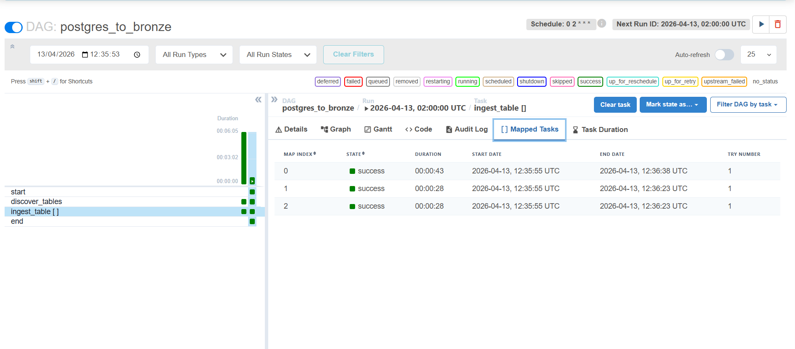
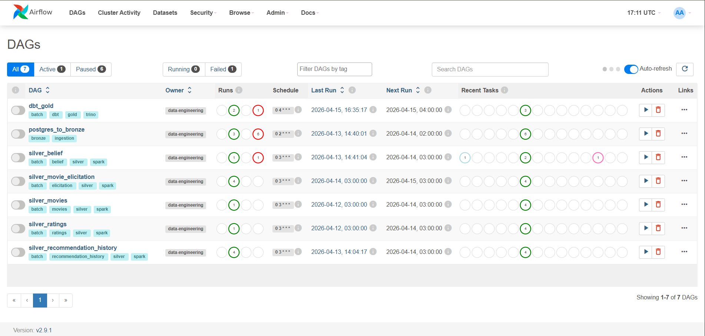
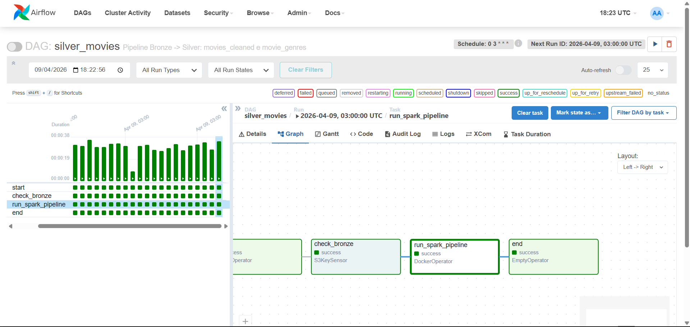
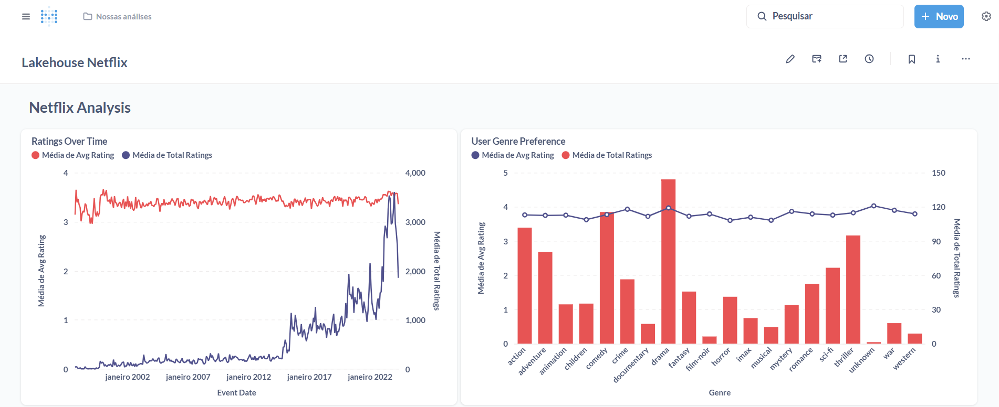
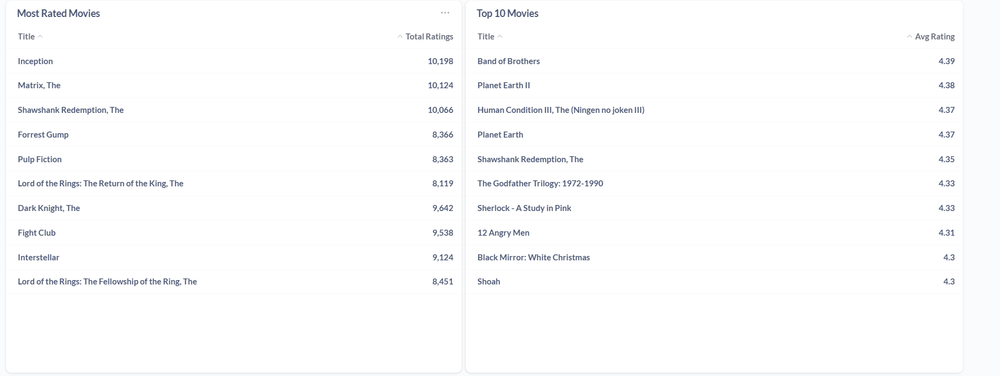
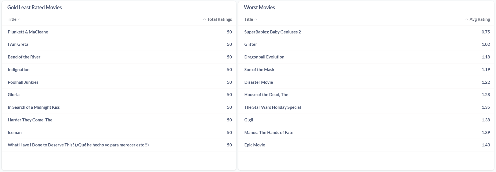
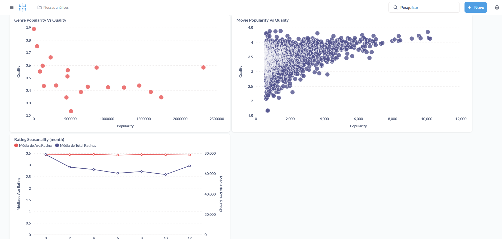

# 🏗️ Data Lakehouse - End-to-End com Tecnologias Open-Source


---

## 📋 Descrição do Projeto

Este projeto é um **Data Lakehouse completo**, construído 100% com tecnologias open-source e containerizado com Docker. O objetivo central é o **aprendizado e evolução técnica** em engenharia de dados, percorrendo todo o ciclo de vida do dado, desde a ingestão de dados brutos até a visualização analítica.

### 🎯 Objetivo

Construir uma plataforma de dados moderna, capaz de:

- Ingerir dados via **streaming** (Kafka + Spark Structured Streaming) e **batch** (PySpark + Airflow)
- Armazenar dados em um **Data Lake compatível com S3** (MinIO), com versionamento e transações ACID via **Delta Lake**
- Transformar e modelar dados por meio de camadas **Bronze -> Silver -> Gold**
- Orquestrar todos os pipelines com **Apache Airflow**
- Disponibilizar os dados para consulta via **Trino** e visualização no **Metabase**

### 🏆 Desafio Proposto

O projeto foi desenvolvido com base no desafio proposto pelo canal do YouTube abaixo, utilizando o dataset **MovieLens Belief 2024** como fonte de dados principal.

- 📺 **YouTube**: [Assista ao desafio aqui](https://www.youtube.com/watch?v=38FhOVq3tI0)
- 📦 **Dataset**: [MovieLens ml_belief_2024](https://grouplens.org/datasets/movielens/ml_belief_2024/)
- 📄 **Documentação base**: [Google Docs](https://docs.google.com/document/d/1FB2CuPPU3fvO7WqRLjbX0qAqOb0E92rvmnUj5gzcR3I/edit?tab=t.0)

---

## 🏛️ Arquitetura da Solução


> 💡 Para uma visualização interativa da arquitetura, consulte o arquivo [`lakehouse.excalidraw`](./lakehouse.excalidraw) na raiz do projeto.

### 🔄 Fluxo Geral

| Etapa | Componente | Descrição |
|-------|-----------|-----------|
| 1️⃣ Ingestão Streaming | Kafka + Spark | CSVs são produzidos no tópico `csv-topic` e consumidos pelo Spark Structured Streaming, gravando na camada Bronze |
| 2️⃣ Ingestão Batch | PySpark + Airflow | Dados do PostgreSQL são extraídos e carregados na camada Bronze via DAG orquestrada |
| 3️⃣ Bronze -> Silver | PySpark + Airflow | Jobs Spark transformam e limpam os dados brutos; resultado gravado em Delta Lake |
| 4️⃣ Silver -> Gold | dbt + Trino + Airflow | Modelos dbt executam SQL via Trino, materializando tabelas analíticas em Parquet no MinIO |
| 5️⃣ Serving | Trino | Consulta federada sobre o Data Lake sem movimentação de dados |
| 6️⃣ Visualização | Metabase | Dashboards conectados ao Trino para análise dos dados Gold |

---

## 🛠️ Tecnologias Utilizadas

| Tecnologia | Versão | Função no Projeto |
|-----------|--------|------------------|
| **Docker & Docker Compose** | latest | Containerização de toda a infraestrutura |
| **Apache Kafka + Zookeeper** | 3.x | Message broker para ingestão de dados em streaming |
| **Apache Spark (PySpark)** | 3.x | Processamento distribuído (streaming e batch) |
| **Apache Airflow** | 2.x | Orquestração e agendamento de pipelines |
| **dbt (data build tool)** | 1.x | Transformações SQL e modelagem da camada Gold |
| **Trino** | latest | Query engine federado para consultas SQL no Data Lake |
| **MinIO** | latest | Armazenamento de objetos compatível com S3 |
| **Hive Metastore** | 3.x | Catálogo de metadados das tabelas do lake |
| **PostgreSQL** | 15 | Banco relacional como fonte de dados (batch) |
| **Metabase** | latest | Visualização de dados e dashboards analíticos |
| **Delta Lake** | 2.x | Formato de tabela com ACID, versionamento e schema evolution |

### 🔑 Analogias para Facilitar o Entendimento

| Componente | Analogia |
|-----------|----------|
| MinIO | HD / pendrive do Data Lake |
| Hive Metastore | Índice do HD (sabe onde cada arquivo está) |
| Trino | Cérebro que entende e executa SQL |
| dbt | Script inteligente que manda comandos SQL ao Trino |

---

## 📁 Estrutura do Projeto

```bash

data-lakehouse/
├── docker-compose.yml            # Definição de todos os serviços
├── .env.example                  # Template de variáveis de ambiente
├── README.md
├── .gitignore
├── lakehouse.excalidraw          # Diagrama visual da arquitetura
│
├── data/
│   └── source/
│       ├── csv/                  # Arquivos CSV para ingestão streaming
│       │   ├── ratings_for_additional_users.csv
│       │   ├── user_rating_history.csv
│       │   └── user_recommendation_history.csv
│       └── postgres/             # Scripts e dados para o PostgreSQL
│           ├── init.sql
│           ├── seed.sql
│           └── csv/
│               ├── belief_data.csv
│               ├── movie_elicitation_set.csv
│               └── movies.csv                  
│
├── ingestion/
│   ├── streaming/
│   │   ├── kafka/
│   │   │   ├── producer.py       # Produtor Kafka para os CSVs
│   │   │   ├── schema_registry.py
│   │   │   └── schemas/
│   │   └── spark/
│   │       └── streaming_job.py  # Job Spark Structured Streaming
│   └── batch/
│       ├── postgres/
│       │   ├── extract.py        # Extração do PostgreSQL
│       │   └── connection.py
│       └── loaders/
│           └── bronze_loader.py  # Carga na camada Bronze
│
├── processing/
│   └── spark/
│       ├── core/                 # Módulos reutilizáveis base
│       │   ├── base_config.py
│       │   ├── base_pipeline.py
│       │   ├── checkpoint.py
│       │   └── writer.py
│       ├── jobs/                 # Jobs por entidade (movies, ratings, etc.)
│       │   └── movies/
│       │       ├── main.py
│       │       ├── movies_config.py
│       │       ├── pipeline.py
│       │       └── transformations.py
│       ├── utils/
│       │   └── spark_session.py
│       └── notebook/
│           ├── explore_bronze.ipynb
│           ├── explore_silver.ipynb
│           └── explore_gold.ipynb
│
├── dbt/
│   ├── dbt_project.yml           # Configuração geral do projeto dbt
│   ├── profiles.yml              # Credenciais de conexão com o Trino
│   ├── models/
│   │   ├── staging/              # Views de limpeza leve sobre a Silver
│   │   │   ├── sources.yml
│   │   │   ├── stg_movies.sql
│   │   │   └── stg_movie_genres.sql
│   │   └── marts/
│   │       ├── core/             # Modelos intermediários
│   │       │   └── int_movie_metrics.sql
│   │       └── analytics/        # Tabelas Gold finais
│   │           └── gold_top_movies.sql
│   ├── tests/
│   ├── logs/
│   └── target/
│
├── orchestration/
│   ├── dags/
│   │   ├── bronze/
│   │   │   └── postgres_to_bronze.py
│   │   ├── silver/
│   │   │   ├── dag_silver_belief.py
│   │   │   ├── dag_silver_movie_elicitation.py
│   │   │   ├── dag_silver_movies.py
│   │   │   ├── dag_silver_ratings.py
│   │   │   └── dag_silver_recommendation_history.py
│   │   └── gold/
│   │       └── dbt_pipeline.py
│   └── plugins/
│       └── dag_factory.py        # Factory compartilhada pelas DAGs Silver
│
├── storage/
│   └── hive/
│       ├── init_metastore.sql
│       └── schemas/
│
├── config/
│   └── settings.py
│
├── utils/
│   └── logger.py
│
├── docs/
│   └── Lakehouse Netflix.pdf     # Relatório analítico gerado no Metabase
│
├── images/                       # Screenshots e diagramas
│   ├── image.png
│   ├── dags.png
│   ├── streaming.png
│   ├── postgres_to_bronze_dag.png
│   ├── silver_movies_dag.png
│   ├── metabase-part1.png
│   ├── metabase-part2.png
│   ├── metabase-part3.png
│   └── metabase-part4.png
│
└── infra/
    ├── docker/                   # Dockerfiles por serviço
    │   ├── kafka/
    │   ├── spark/
    │   ├── airflow/
    │   ├── trino/
    │   ├── metabase/
    │   ├── hive/
    │   └── dbt/
    └── trino/
        ├── catalog/
        └── config/

```

---

## ✅ Pré-requisitos

Antes de executar o projeto, certifique-se de ter instalado:

| Requisito | Versão mínima | Verificar com |
|-----------|--------------|---------------|
| Docker | 24.x+ | `docker --version` |
| Docker Compose | 2.x+ | `docker compose version` |
| Git | qualquer | `git --version` |

### 💻 Recursos de Hardware Recomendados

> ⚠️ O stack completo é pesado. Recomenda-se rodar em uma máquina com recursos adequados.

| Recurso | Mínimo | Recomendado |
|---------|--------|-------------|
| CPU | 4 cores | 8+ cores |
| RAM | 16 GB | 32 GB |
| Disco | 20 GB livres | 50 GB+ |

---

## 🚀 Como Executar

### 1. Clone o repositório

```bash
git clone https://github.com/RafaelViniciusBrambillaAlves/data-lakehouse.git
cd data-lakehouse
```

### 2. Configure as variáveis de ambiente

```bash
cp .env.example .env
```

Edite o arquivo `.env` conforme necessário. Para gerar as chaves do Airflow:

```bash
# Gerar AIRFLOW_FERNET_KEY
python -c "from cryptography.fernet import Fernet; print(Fernet.generate_key().decode())"

# Gerar AIRFLOW_SECRET_KEY
python -c "import secrets; print(secrets.token_hex(32))"
```

### 3. Suba a infraestrutura

```bash
docker compose up -d
```

### 4. Acesse os serviços

| Serviço | URL | Credenciais |
|---------|-----|-------------|
| **MinIO** | http://localhost:9001 | `minioadmin` / `minioadmin` |
| **Airflow** | http://localhost:8080 | `admin` / (definido no .env) |
| **Trino** | http://localhost:8085 | - |
| **Metabase** | http://localhost:3000 | (configurar no primeiro acesso) |
| **Spark UI** | http://localhost:4040 | - |
| **Notebook Spark** | http://localhost:8888 | Exploarar dados, por meior dos notebooks |

---

## 🔄 Pipeline de Dados

### Visão geral do fluxo

```
CSV Files ──┐
             ├──▶ Kafka ──▶ Spark Streaming ──▶ 🥉 Bronze
PostgreSQL ──┘                                      │
                                              PySpark + Airflow
                                                    │
                                               🥈 Silver
                                                    │
                                           dbt + Trino + Airflow
                                                    │
                                               🥇 Gold
                                                    │
                                              Trino + Metabase
```

---

### 📡 Ingestão Streaming (Kafka + Spark)

O pipeline de streaming lê arquivos CSV e os publica no Kafka via producer Python. O Spark Structured Streaming consome o tópico `csv-topic` e grava os dados na camada Bronze sem transformações.

O sistema mantém estado para evitar reprocessamento:

**`data/state/offsets.json`** - rastreia o número de linhas já lidas por arquivo:
```json
{
  "/data/source/csv/ratings_for_additional_users.csv": 4185688,
  "/data/source/csv/user_rating_history.csv": 2046124,
  "/data/source/csv/user_recommendation_history.csv": 1285664
}
```

**`data/state/schemas.json`** - evita duplicidade de tópicos registrando schemas conhecidos:
```json
{
  "schemas": {
    "ratings_for_additional_users": ["userId", "movieId", "rating", "tstamp"],
    "user_recommendation_history": ["userId", "tstamp", "movieId", "predictedRating"]
  }
}
```


---

### 📦 Ingestão Batch (PostgreSQL -> Bronze)

Dados relacionais do PostgreSQL são extraídos via PySpark e carregados na camada Bronze, orquestrados pelo Airflow.

**DAG:** `postgres_to_bronze`



---

### ⚙️ Processamento Bronze -> Silver

Jobs PySpark aplicam limpeza, tipagem e validações nos dados brutos. O processamento é orquestrado pelo Airflow com uma DAG por entidade.



**Exemplo - DAG Silver Movies:**



---

### 🏆 Processamento Silver -> Gold (dbt)

A camada Gold é construída pelo dbt, que executa modelos SQL via Trino, materializando tabelas analíticas em Parquet no MinIO.

**Estrutura dos modelos dbt:**

| Arquivo | Função |
|---------|--------|
| `dbt_project.yml` | Configuração central do projeto - define regras de materialização |
| `profiles.yml` | Credenciais de conexão com o Trino |
| `sources.yml` | Declara as tabelas Silver para o dbt |
| `stg_movies.sql` | Limpeza leve do movies (view, sem arquivo físico) |
| `stg_movie_genres.sql` | Limpeza leve dos gêneros (view) |
| `gold_*.sql` | Tabelas Gold finais, materializadas em Parquet no MinIO |

**DAG dbt Pipeline** orquestrada pelo Airflow: `dbt_pipeline`

---

## ⚡ Otimizações de Performance

Um dos principais aprendizados do projeto foi a **evolução iterativa** dos jobs Spark. Os pipelines passaram por quatro versões distintas: sem otimizações, com melhorias pontuais, refatorados com módulos reutilizáveis e por fim orquestrados pelo Airflow.

### Comparativo Bronze -> Silver (tempo em segundos)

| Tabela | Sem melhorias | Com melhorias | Refatorado | Com Airflow |
|--------|:-------------:|:-------------:|:----------:|:-----------:|
| **Movies** | 44.67s | 33.36s | 30.11s | **29.98s** |
| **Belief Data** | 838.09s | 350.13s | 140.85s | **54.86s** |
| **Movie Elicitation** | 23.63s | 22.43s | 18.14s | **18.20s** |
| **Ratings** | 101.76s | 45.77s | 41.10s | **39.18s** |
| **Recommendation History** | 689.72s | 340.09s | 47.92s | **69.12s** |

### 📊 Destaque - Belief Data

| Versão | Tempo | Ganho |
|--------|-------|-------|
| Original | 838.09s (~14 min) | - |
| Com melhorias | 350.13s | **-58%** |
| Refatorado | 140.85s | **-83%** |
| Com Airflow | 54.86s | **-93%** |

> 💡 **Principais técnicas aplicadas:** particionamento adequado, evitar reprocessamento e contagem de linhas.

---

## 🥇 Camada Gold - Modelos Analíticos

Todas as tabelas Gold são materializadas em **Parquet** no MinIO e acessíveis via **Trino**.

| Tabela Gold | Descrição |
|-------------|-----------|
| `gold_ratings_over_time` | Evolução temporal dos ratings - volume, média e sentimento dos usuários ao longo do tempo |
| `gold_top_movies` | Ranking dos filmes mais bem avaliados com volume mínimo de ratings |
| `gold_worst_movies` | Filmes com pior avaliação média - identifica outliers negativos |
| `gold_most_rated_movies` | Filmes com maior volume de avaliações - engajamento dos usuários |
| `gold_least_rated_movies` | Filmes com menor volume - conteúdos pouco consumidos ou pouco conhecidos |
| `gold_genre_popularity` | Popularidade e qualidade média por gênero |
| `gold_user_activity` | Comportamento dos usuários: volume, média, taxa de positivos e última atividade |
| `gold_movie_popularity_vs_quality` | Comparativo popularidade × qualidade - identifica hits, nichos e outliers |
| `gold_user_genre_preference` | Preferência de gêneros por usuário, com média e frequência |
| `gold_rating_distribution` | Distribuição geral das notas - padrão de comportamento dos usuários |
| `gold_underrated_movies` | Filmes de alta qualidade com baixa popularidade - recomendação de conteúdo escondido |
| `gold_rating_seasonality` | Padrões temporais de avaliação por mês e dia da semana |

---

## 📊 Dashboard

O projeto inclui um relatório analítico gerado no **Metabase**, disponível em:

📄 [`docs/Lakehouse Netflix.pdf`](./docs/Lakehouse%20Netflix.pdf)

### Screenshots do Dashboard


*Visão geral: distribuição de ratings e top filmes*


*Análise de popularidade vs. qualidade*


*Popularidade por gênero e tendências temporais*


*Comportamento dos usuários e sazonalidade*

---

## 🧰 Comandos Úteis

### 🐘 PostgreSQL - Verificar dados da fonte

```bash
docker exec -it postgres-lakehouse psql -U admin -d lakehouse

-- Verificar contagem das tabelas de origem
SELECT COUNT(*) FROM raw.movies;
SELECT COUNT(*) FROM raw.movie_elicitation_set;
SELECT COUNT(*) FROM raw.belief_data;
```

### 📨 Kafka - Inspecionar tópico

```bash
docker exec -it kafka bash
kafka-console-consumer \
  --bootstrap-server kafka:9092 \
  --topic csv-topic \
  --from-beginning
```

### ⚡ Spark - Executar Jobs Bronze -> Silver

```bash
docker exec -it spark bash

# Movies
/opt/spark/bin/spark-submit /opt/spark/app/processing/spark/jobs/movies/main.py

# Belief Data
/opt/spark/bin/spark-submit /opt/spark/app/processing/spark/jobs/belief/main.py

# Movie Elicitation
/opt/spark/bin/spark-submit /opt/spark/app/processing/spark/jobs/movie_elicitation/main.py

# Ratings
/opt/spark/bin/spark-submit /opt/spark/app/processing/spark/jobs/ratings/main.py

# Recommendation History
/opt/spark/bin/spark-submit /opt/spark/app/processing/spark/jobs/recommendation_history/main.py
```

### 🐝 Hive Metastore - Inspecionar catálogo

```bash
docker exec -it spark bash
/opt/spark/bin/pyspark

# No PySpark:
spark.sql("SHOW DATABASES").show()
spark.sql("USE bronze")
spark.sql("SHOW TABLES IN bronze").show()
spark.sql("SHOW TABLES IN silver").show()
```

### 🔍 Trino - Consultas no Data Lake

```bash
docker compose up -d trino

# Acessar o CLI do Trino
trino --server http://localhost:8085
# ou
trino --server http://localhost:8085 --user dbt

-- Explorar catálogos e schemas
SHOW CATALOGS;
SHOW SCHEMAS FROM delta;
SHOW TABLES FROM delta.silver;
SHOW TABLES FROM delta.gold;
```

### 🛠️ dbt - Transformações Silver -> Gold

```bash
# Rodar todos os modelos
docker compose run --rm dbt run

# Rodar um modelo específico
docker compose run --rm dbt run --select dim_movies

# Rodar todos os modelos gold
docker compose run --rm dbt run --select tag:gold

# Executar testes de qualidade
docker compose run --rm dbt test

# Testar um modelo específico
docker compose run --rm dbt test --select dim_movies

# Gerar e servir documentação
docker compose run --rm dbt docs generate
docker compose run --rm dbt docs serve --port 8090
```

### 📓 Jupyter - Exploração interativa

```bash
docker run -it --rm -p 8888:8888 \
  --network data-lakehouse_lakehouse-network \
  jupyter/pyspark-notebook
```

---

## 🎓 Principais Aprendizados

Este projeto foi uma jornada de evolução técnica contínua. Os principais aprendizados foram:

1. **Arquitetura em camadas (Medallion Architecture)** - A separação Bronze/Silver/Gold torna o pipeline auditável, reproduzível e evolutivo. Cada camada tem uma responsabilidade clara.

2. **Otimização de jobs Spark não é trivial** - Pequenas mudanças (particionamento, evitar certos códigos) geraram ganhos de até **93%** no tempo de execução. Medir antes de otimizar é essencial.

3. **Streaming com estado** - Controlar offsets e schemas manualmente tornou o pipeline idempotente e resiliente a reprocessamentos.

4. **dbt como camada de transformação SQL** - Separar a lógica de negócio em modelos SQL versionados facilita testes, documentação e manutenção.

5. **Orquestração importa** - Migrar de execução manual para DAGs no Airflow trouxe controle de dependências, logs centralizados e reprocessamento. 

6. **Trino como query engine** - Consultar dados diretamente no Data Lake sem necessidade de ETL para um banco relacional é uma enorme vantagem operacional.

7. **Docker Compose para orquestrar infraestrutura complexa** - Gerenciar 10+ serviços com um único arquivo é poderoso, mas exige atenção a healthchecks, dependências e volumes.

8. **Importância de módulos reutilizáveis** - A refatoração do `core/` (base_config, base_pipeline, writer) reduziu drasticamente duplicação de código entre os jobs.

---

## 🔮 Próximos Passos

- [ ] Implementar **schema evolution** automático no Delta Lake
- [ ] Adicionar **qualidade de dados** com Great Expectations ou dbt tests mais abrangentes
- [ ] Configurar **alertas e monitoramento** no Airflow (Slack/Email em falhas)
- [ ] Evoluir o dashboard Metabase com métricas de negócio mais aprofundadas
- [ ] Adicionar **CI/CD** para execução automática dos dbt models
- [ ] Explorar **incremental models** no dbt para reduzir tempo de processamento
- [ ] Implementar **particionamento por data** nas tabelas Gold para otimizar queries Trino
- [ ] Adicionar **controle de versão de modelos** com MLflow (futuro: recomendação de filmes)
- [ ] Migrar para **Apache Iceberg** como alternativa ao Delta Lake

---

## 📚 Referências

- 📺 [Desafio no YouTube](https://www.youtube.com/watch?v=38FhOVq3tI0)
- 📦 [Dataset MovieLens Belief 2024 - GroupLens](https://grouplens.org/datasets/movielens/ml_belief_2024/)
- 📄 [Documentação base do desafio](https://docs.google.com/document/d/1FB2CuPPU3fvO7WqRLjbX0qAqOb0E92rvmnUj5gzcR3I/edit?tab=t.0)
- 📖 [Apache Kafka Documentation](https://kafka.apache.org/documentation/)
- 📖 [Apache Spark Documentation](https://spark.apache.org/docs/latest/)
- 📖 [Delta Lake Documentation](https://docs.delta.io/latest/index.html)
- 📖 [Apache Airflow Documentation](https://airflow.apache.org/docs/)
- 📖 [dbt Documentation](https://docs.getdbt.com/)
- 📖 [Trino Documentation](https://trino.io/docs/current/)
- 📖 [MinIO Documentation](https://min.io/docs/minio/container/index.html)

---

<div align="center">

📬 Contato

Se você gostou do projeto? Tem alguma dica, feedback ou oportunidade? Vou gostar de conversar com você!

💼 LinkedIn: https://www.linkedin.com/in/rafaelviniciusbrambillaalves/

Feito para fins de **aprendizado e evolução técnica em Engenharia de Dados e Desenvolvimento de Software**

</div>